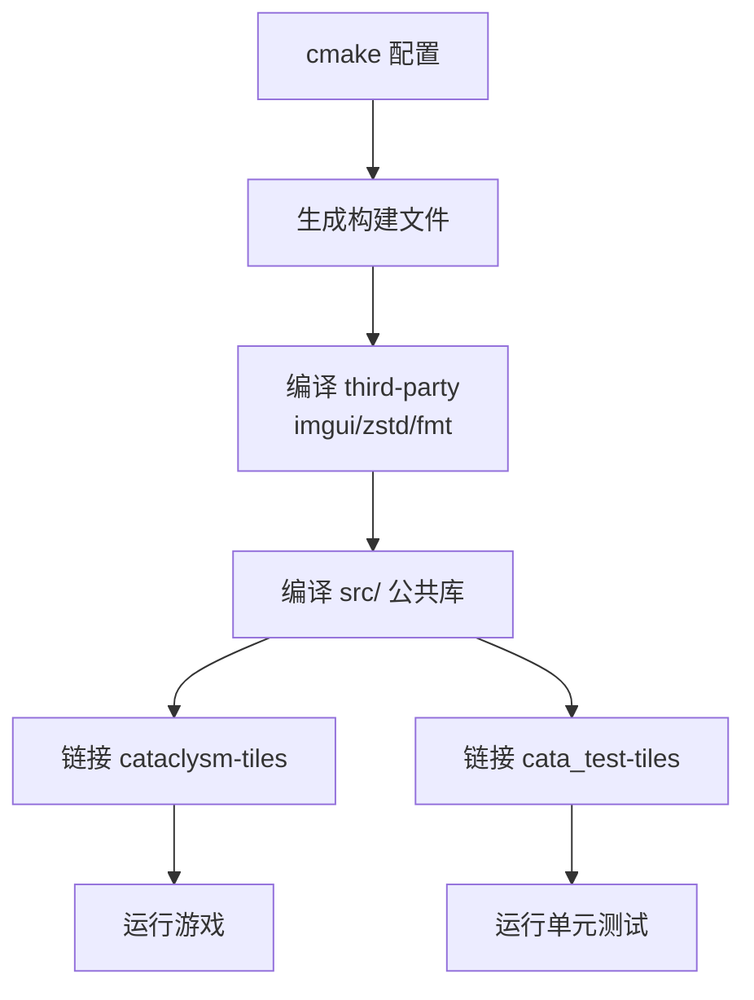

# 编译游戏

## 依赖

CCB 使用 CMake 构建，需要：

- C++ 编译器（GCC / Clang）
- CMake、Ninja 或 Make
- SDL2（或 SDL3）、SDL2_ttf、SDL2_image、SDL2_mixer
- FreeType

## 构建步骤

```bash
# 配置（Release + 贴图 + 音效 + 测试）
cmake -S . -B build \
  -DCMAKE_BUILD_TYPE=Release \
  -DTILES=ON -DSOUND=ON -DTESTS=ON -DLOCALIZE=ON

# 编译（按机器内存调整并行度 -jN）
cmake --build build -j4
```

:::tip 内存不足时
单个大文件（如 `character.cpp`）编译会吃 1–2GB 内存。如果遇到 `Killed signal terminated program cc1plus`，说明内存不足（OOM），把 `-jN` 调小（如 `-j4`）即可。
:::

:::tip /tmp 空间不足
GCC 把中间汇编写到 `/tmp`。若 `/tmp` 是较小的 tmpfs，可能报 `Disk quota exceeded`。设置 `TMPDIR` 指向大磁盘：

```bash
TMPDIR=/path/to/big-disk/tmp cmake --build build -j4
```
:::

## 构建流程图



## 产物

- `build/src/cataclysm-tiles` —— 游戏主程序
- `build/tests/cata_test-tiles` —— 单元测试

下一步：[贡献流程](./contributing)
