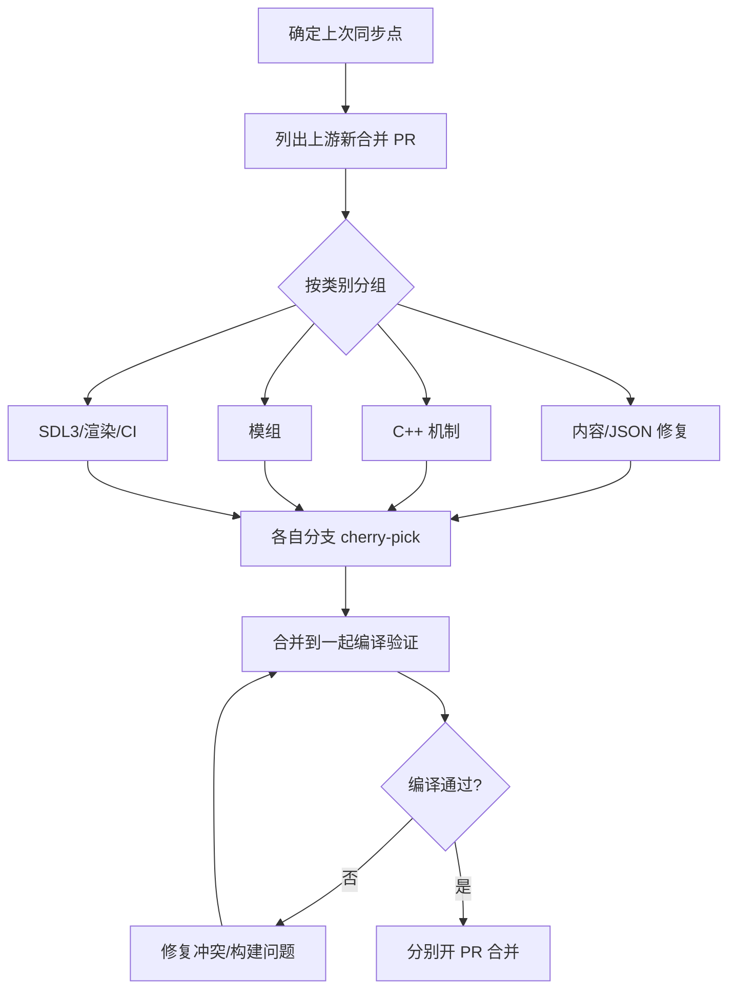

# 贡献流程

## 同步上游 CDDA

CCB 定期从 [CleverRaven/Cataclysm-DDA](https://github.com/CleverRaven/Cataclysm-DDA) 同步已合并的 PR。典型流程是按类别分支 cherry-pick，便于分批审查和合并。



## 提交 PR 的规范

- **分支命名**：按内容类别（如 `sync-cdda-cpp`、`sync-cdda-mods`）
- **不直接推 master**：永远在新分支上工作
- **PR 标题简洁**：说明同步范围或修复内容
- **PR 描述**：列出包含的上游 PR、验证情况（是否编译通过）

## 处理合并冲突

当多个分支改了同一文件（例如 A 和 B 都改了 `containers.json`），先合无冲突的分支，再 rebase 有冲突的分支到最新 master，按上游权威态解决冲突。

```bash
git checkout <冲突分支>
git rebase origin/master
# 解决冲突后
git add <冲突文件>
git rebase --continue
git push --force-with-lease origin <冲突分支>
```

## 编译验证

合并前务必本地编译通过（见[编译游戏](./build)）。数据类改动（JSON）也应通过 JSON 校验，避免格式错误导致游戏加载失败。
