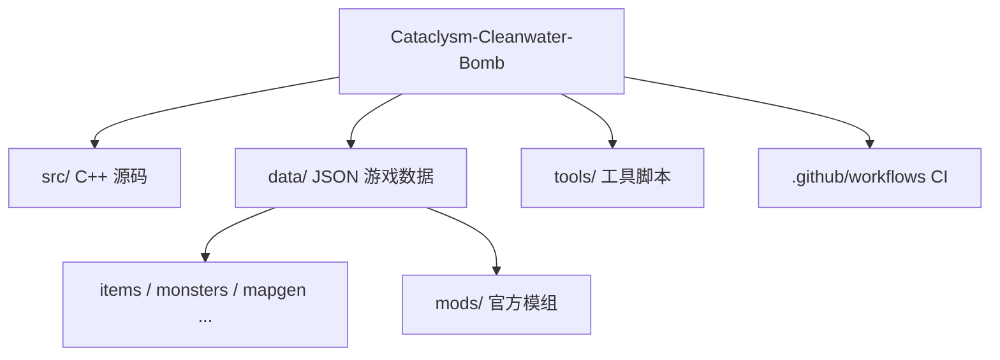
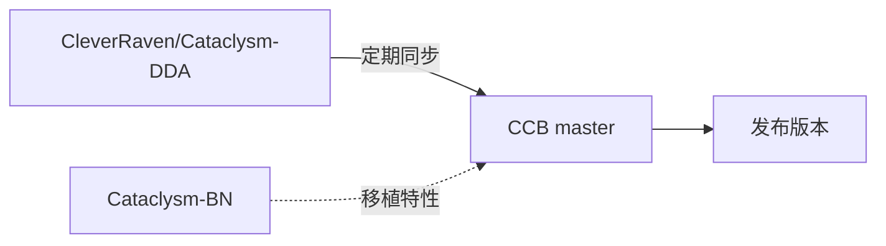

# 开发者教程

面向想要参与 CCB 开发、编译游戏、或制作模组的贡献者。

## 包含内容

- **[编译游戏](./build)** —— 从源码构建 CCB
- **[贡献流程](./contributing)** —— 同步上游、提交 PR 的工作流

## 项目结构

CCB 基于 CDDA，主要源码在 `src/`，游戏数据为 JSON，位于 `data/`。

## 上游关系

