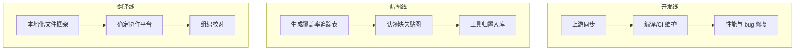

# 当前工作大纲

这里汇总 CCB 三条贡献线（开发 / 贴图 / 翻译）的当前状态。高层方向见[开发方向与愿景](./vision)，具体到天的任务在 GitHub 上管理。

:::info 状态如何更新
本页是**高层进度概览**，手动维护、不追求实时。颗粒度的任务（具体 issue、bug、PR）请看仓库的 [GitHub Issues](https://github.com/LYHGLYTX/Cataclysm-Cleanwater-Bomb/issues) 与 Pull Requests。
:::

## 三条线总览

## 开发线

| 任务 | 状态 |
|---|---|
| 定期同步 CDDA 上游 PR | 🟢 进行中 |
| 编译与 CI 维护 | 🟢 进行中 |
| 性能优化（大存档 / 密集场景） | 🟡 计划中 |
| 自有特性（载具部件着色等） | 🟢 已落地，持续打磨 |

## 贴图线

| 任务 | 状态 |
|---|---|
| 贴图覆盖率统计工具（`tileset_coverage.py`） | ✅ 已完成 |
| 多工作表贴图追踪表（`tileset_workbook.py`） | ✅ 已完成 |
| 贡献归置工具（`ingest_contributions.py`，含校验/替换/备份） | ✅ 已完成 |
| 补全缺失贴图（地图事件、物品、怪物等） | 🟢 进行中 |

贴图贡献流程见[贴图贡献指南](/docs/contribute/tileset)。

## 翻译线

| 任务 | 状态 |
|---|---|
| 本地化文件结构与工具链（`.po` / `.mo`） | ✅ 已就绪 |
| 确定翻译协作平台与提交流程 | 🟡 待定 |
| 组织社区校对 | ⚪ 未开始 |

翻译参与方式见[翻译贡献指南](/docs/contribute/translation)。

## 状态图例

| 标记 | 含义 |
|---|---|
| ✅ 已完成 | 已交付 |
| 🟢 进行中 | 正在做 |
| 🟡 计划中 / 待定 | 已排期或待决策 |
| ⚪ 未开始 | 尚未启动 |

## 想认领任务？

- 找具体的 bug / 功能：看 [GitHub Issues](https://github.com/LYHGLYTX/Cataclysm-Cleanwater-Bomb/issues)
- 想画贴图：[贴图贡献](/docs/contribute/tileset) + 贴图 QQ 群（694984594）
- 想参与开发 / 翻译：[社区](/community)的开发贡献群（252513599）
