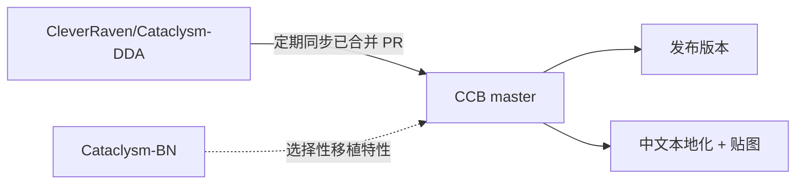

# 开发方向与愿景

## CCB 是什么

**Cataclysm: Cleanwater Bomb (CCB)** 是基于 [Cataclysm: Dark Days Ahead (CDDA)](https://github.com/CleverRaven/Cataclysm-DDA) 的一个分支。我们持续同步上游的内容与修复，同时加入自有特性，并专注于**简体中文社区**的使用体验。

## 与上游的关系

- **跟随 CDDA**：定期从上游同步内容、机制修复、模组更新，保持与主线接轨。
- **借鉴 BN**：从 Cataclysm-BN 等分支选择性移植受欢迎的特性。
- **自有方向**：在同步之外，做我们认为值得做的改进。

## 长期方向

CCB 关注这几条主线：

| 方向 | 说明 |
|---|---|
| **上游同步** | 持续跟进 CDDA，分类批量 cherry-pick，保证内容不落后 |
| **贴图体验** | 维护 UNDEAD_PEOPLE 贴图包，补全缺失贴图，工具化贡献流程 |
| **中文本地化** | 改进简体中文翻译质量，建立可持续的翻译协作 |
| **性能优化** | 针对大型存档、密集场景的性能问题做优化 |
| **自有特性** | 载具部件着色等已落地特性，以及社区提出的新点子 |

## 我们的原则

- **稳定优先**：同步上游时编译验证、分批合并，不把破坏性改动直接塞进 master。
- **社区驱动**：方向由社区共同决定，贴图、翻译、内容都欢迎贡献。
- **工具化**：能用工具自动化的协作流程就工具化（比如贴图归置），降低参与门槛。

## 参与进来

想推动某个方向？欢迎到[社区](/community)讨论，或直接通过[贡献指南](/docs/contribute/intro)动手。当前在做的具体工作见[工作大纲](./status)。
